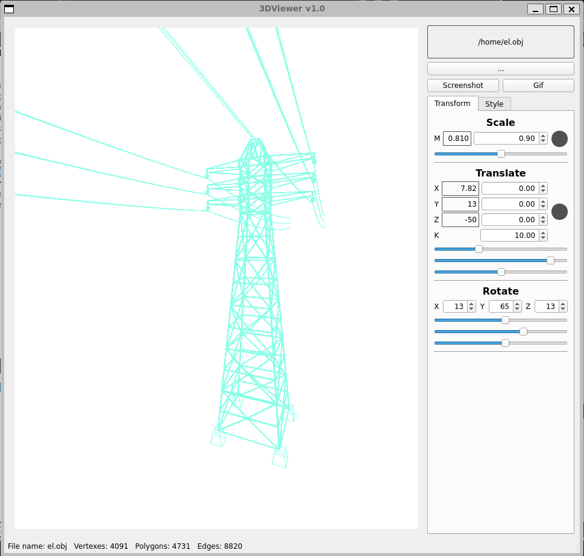
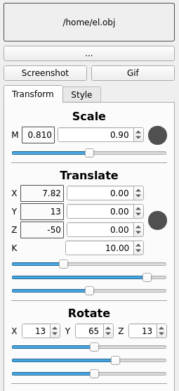
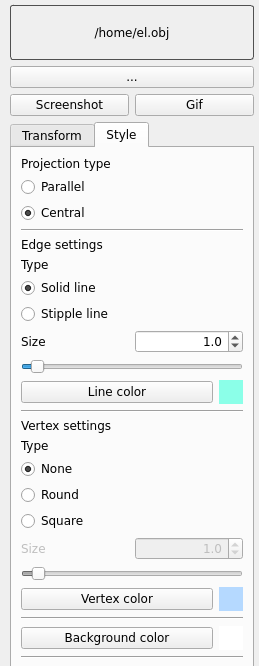
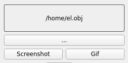

# 3DViewer v1.0

В проекте реализована программа для просмотра 3D моделей в каркасном виде (3D Viewer) 
на языке программирования Си. Имеется возможность пименять к моделям афинные преобразования (вращение, масштабирование, перемещение). 
Модели загружаются из файлов формата .obj.

## Описание функционала 3DViewer

- Программа разработана на языке Си стандарта C11 с использованием компилятора gcc. 
- Код программы находится в папке src 
- Сборка программы настроена с помощью Makefile со стандартным набором целей для GNU-программ: all, install, uninstall, clean, dvi, dist, test, gcov_report. Установка производится в каталог 3DViewer_v1.0/build
- Программа разработана в соответствии с принципами структурного программирования
- При написании кода необходимо придерживаться Google Style
- Обеспечено покрытие unit-тестами модулей, связанных с загрузкой моделей и аффинными преобразованиями, с помощью библиотеки Check
- Программа предоставляет возможность:
    - Загружать каркасную модель из файла формата obj (поддержка только списка вершин и поверхностей).
    - Перемещать модель на заданное расстояние относительно осей X, Y, Z.
    - Поворачивать модель на заданный угол относительно своих осей X, Y, Z
    - Масштабировать модель на заданное значение.
- Графический пользовательский интерфейс реализован на базе Qt
- Графический пользовательский интерфейс содержит:
    - Кнопку для выбора файла с моделью и поле для вывода его названия.
    - Зону визуализации каркасной модели.
    - Кнопку/кнопки и поля ввода для перемещения модели. 
    - Кнопку/кнопки и поля ввода для поворота модели. 
    - Кнопку/кнопки и поля ввода для масштабирования модели. 
    - Информацию о загруженной модели - название файла, кол-во вершин и ребер.

## Настройки

 - Программа позволяет настраивать тип проекции (параллельная и центральная)
 - Программа позволяет настраивать тип (сплошная, пунктирная), цвет и толщину ребер, способ отображения (отсутствует, круг, квадрат), цвет и размер вершин
 - Программа позволяет выбирать цвет фона

 ## Запись

 - Программа позволяет сохранять полученные ("отрендеренные") изображения в файл в форматах bmp и jpeg
 - Программа позволяет по специальной кнопке записывать небольшие "скринкасты" - текущие пользовательские аффинные преобразования загруженного объекта в gif-анимацию (640x480, 10fps, 5s)

